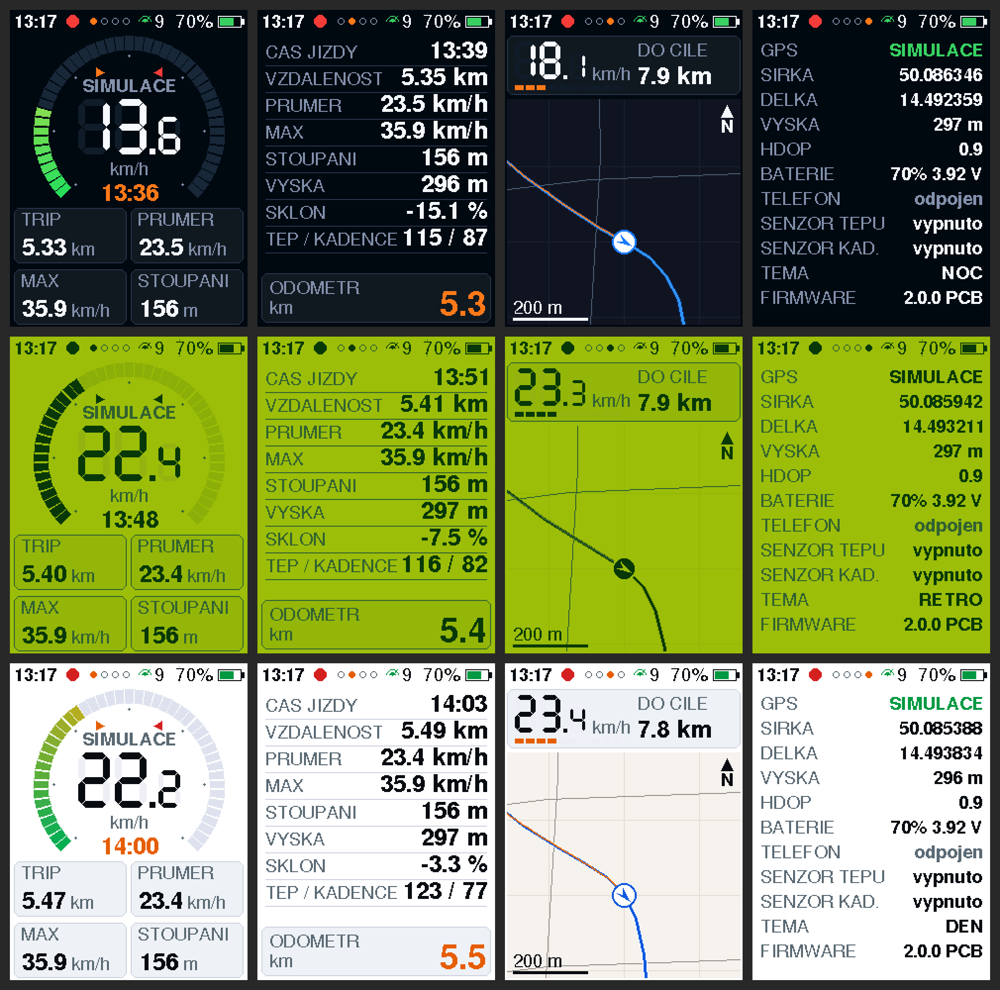

# CykloComp – chytrý cyklopočítač (ESP32-C3) + aplikace + PCB + krabička

Vlastní „Garmin“ na řídítka: **Waveshare ESP32-C3-Zero**, barevný displej
ST7789, GPS a Li-Po baterie. Zobrazuje rychlost, trasu s mapou ulic, tep a
kadenci z BLE senzorů, ukládá jízdy a přes Bluetooth si povídá s aplikací
v telefonu. Vzhled je inspirovaný „DS / Game Boy“ cyklopočítači – barevný
budík rychlosti a retro zelené LCD téma.

| Plošný spoj CykloPCB v1 | 3D krabička s Garmin úchytem |
|---|---|
|  |  |

## Co je v repozitáři

| Složka | Co to je |
|---|---|
| [`firmware/CykloComp/`](firmware/CykloComp/CykloComp.ino) | firmware v2 pro ESP32-C3 (Arduino IDE) |
| [`firmware/host_preview/`](firmware/host_preview/) | náhled displeje na PC – stejný kód vykreslí obrazovky do PNG (bez hardwaru) |
| [`webapp/`](webapp/README.md) | **mobilní aplikace** (PWA, Web Bluetooth) – doporučená |
| [`app/`](app/README.md) | původní React Native aplikace (kompatibilní, dál se nevyvíjí) |
| [`hardware/pcb/`](hardware/pcb/README.md) | plošný spoj: KiCad, Gerber + BOM + CPL pro JLCPCB, schéma |
| [`hardware/enclosure/`](hardware/enclosure/README.md) | 3D tištěná krabička (OpenSCAD + STL), Garmin quarter-turn |
| [`tools/usb_console.py`](tools/usb_console.py) | ladění přes USB bez telefonu |
| [`docs/NAKUP.md`](docs/NAKUP.md) | **co doobjednat** |
| [`docs/DOPORUCENI.md`](docs/DOPORUCENI.md) | web vs. nativní appka, lepší displej, lepší nabíjení |

## Rychlý start

1. **Firmware** – Arduino IDE, deska *ESP32C3 Dev Module*,
   *USB CDC On Boot: Enabled*, *Partition Scheme: Default 4MB with spiffs*.
   Knihovny: `Adafruit GFX`, `Adafruit ST7735 and ST7789`, `TinyGPSPlus`,
   `NimBLE-Arduino` **2.x**. V `CykloComp.ino` vyber `BOARD_PROFILE`
   (`BOARD_BREADBOARD` = současné zapojení, `BOARD_CYKLOPCB_V1` = nový plošný spoj)
   a nahraj. Bez GPS signálu to vyzkoušíš příkazem `SIM:1` (USB nebo appka).
2. **Aplikace** – otevři `webapp/` v Chrome na Androidu (návod na nasazení v
   [webapp/README.md](webapp/README.md)) → *Připojit CykloComp*. Bez hardwaru:
   *Vyzkoušet demo*.
3. **PCB** – nahraj `hardware/pcb/build/CykloPCB_v1_gerber_JLCPCB.zip` + BOM + CPL
   na JLCPCB ([postup](hardware/pcb/README.md)).
4. **Krabička** – změř displej a baterii, uprav parametry a vytiskni
   ([postup](hardware/enclosure/README.md)). Nejdřív `garmin_test.stl`!

## Firmware v2

### Ovládání

| Tlačítko | Krátce | Dlouze |
|---|---|---|
| **MODE** (BTN1) | další obrazovka | vypnout (spánek, probudí MODE – jen na PCB) |
| **START** (BTN2) | start / stop jízdy (po stopu souhrn jízdy) | vynulovat trip |
| **PAUZA** (BTN3) | při jízdě pauza/pokračovat, jinak předchozí obrazovka | přepnout téma NOC → RETRO → DEN |

První stisk při ztlumeném displeji jen rozsvítí.

### Obrazovky
1. **DASH** – barevný oblouk rychlosti (šipky = průměr a maximum), velké
   7-segmentové číslice, čas jízdy a 4 nastavitelné dlaždice (z 14 hodnot:
   trip, čas, průměr, max, výška, odometr, satelity, hodiny, stoupání, sklon,
   tep, kadence, baterie, do cíle).
2. **STATISTIKY** – kompletní přehled jízdy + odometr.
3. **MAPA** – trasa z appky, ulice z OpenStreetMap, projetá stopa, šipka směru,
   „DO CÍLE“ a rychloměrný proužek jako na Game Boyi.
4. **SYSTÉM** – GPS, poloha, HDOP, baterie, Bluetooth, senzory, verze.

### Co umí navíc proti v1
- 3 témata (**NOC** – tmavá DS deska, **RETRO** – Game Boy zelená, **DEN** – kontrast na slunce)
- **jízdy se ukládají do flash** (LittleFS, posledních 40) a appka si je stáhne → telefon nemusí být během jízdy připojený
- **autopauza**, **stoupání** (s hysterezí), **sklon**, filtrace skoků GPS a špatného HDOP
- **baterie** (%, nabíjení přes USB, varování, vypnutí při vybití), **jas podsvícení**, ztlumení při stání
- **spánek** a automatické vypnutí po nečinnosti (PCB), vypínání GPS
- **BLE senzory**: hrudní pás (Heart Rate 0x180D) a kadence (CSC 0x1816) – běží ve vlastním vlákně
- hodiny z telefonu, když GPS ještě nemá čas
- příkazy z BLE se zpracovávají ve smyčce (žádné souběhy s kreslením)
- **simulace jízdy** `SIM:1` – jede po nahrané trase, ukáže i autopauzu

Kód je jeden `.ino` (podmínka Arduino IDE – ve složce sketche jen jeden `.ino`).

### Náhled displeje na PC
`firmware/host_preview/build_preview.sh` přeloží **ten samý** `CykloComp.ino`
pro PC (displej = pole pixelů), odsimuluje jízdu a uloží PNG všech obrazovek ve
všech tématech – hodí se při úpravách vzhledu bez nahrávání do ESP.

## BLE protokol (firmware ↔ appka)

Service `a5c40001-2f0b-4f6e-9d3a-8c1e2b7d9f10`, charakteristiky `a5c4000X-…`:

| UUID | Typ | Obsah |
|---|---|---|
| `…0002` telemetrie | READ + NOTIFY, 1×/s | `{"fix","spd","lat","lng","alt","dst","tim","sat","rid","pau","bat","asc","max","hr","cad"}` (≤ 173 B) |
| `…0003` příkazy | WRITE + WRITE_NR | textové příkazy níže (≤ 255 B) |
| `…0004` stav | READ + NOTIFY, 1×/5 s | `{"fw","brd","odo","vb","chg","thm","bl","ap","sen","hrc","csc","grd","avg","hdp","crs","scr","tz","aoff","gmax","sim","apa","fs","rcur","f":[…]}` |
| `…0005` bulk | READ | odpovědi na `SYNC:*` (`{"req":"…",…}`, ≤ 512 B) |

`bat` = 0–100 %, 101 = napájení z USB, −1 = neměří se.

Příkazy:
- jízda: `RIDE:START|STOP|PAUSE|RESUME`, `RESET_TRIP`
- čas: `SET_TZ:<h>`, `TIME:<unix>`
- displej: `SCREEN:<0-3>`, `THEME:<0-2>`, `BL:<5-100>`, `GAUGE:<km/h>`, `CFG:FIELDS:a,b,c,d` (0–13)
- chování: `AP:0|1` (autopauza), `SENS:0|1` (BLE senzory), `AUTOOFF:<min>`, `ODO:<km>`, `SIM:0|1`, `PWROFF`, `INFO`
- trasa: `RT:BEGIN` / `RT:P:lat,lng;…` / `RT:END` / `RT:CLEAR`
- ulice: `MP:BEGIN` / `MP:P:…` / `MP:END` (segmenty oddělené `999,999`)
- uložené jízdy: `SYNC:LIST`, `SYNC:SUM:<id>`, `SYNC:TRK:<id>:<strana>` (24 bodů/strana), `SYNC:DEL:<id>` →
  odpověď se přečte z bulk charakteristiky (appka čte, dokud `req` neodpovídá dotazu)

Stará React Native appka funguje dál – nová pole ignoruje.

## Testování přes USB (bez telefonu)

Firmware zvládá **stejný textový protokol i po USB** (nativní USB-CDC).

1. Arduino IDE: **Tools → USB CDC On Boot → Enabled**.
2. Serial Monitor (115200) nebo `python3 tools/usb_console.py [PORT]` (`pip install pyserial`).
3. Piš příkazy (`SIM:1`, `RIDE:START`, `THEME:1`, `SYNC:LIST`…) a sleduj
   telemetrii (1×/s), `STATUS:` (1×/5 s) a odpovědi `BULK:`.
   `usb_console.py` umí `testroute` – pošle ukázkovou trasu.

## Akceptační test (ruční, na reálném HW)

1. **Připojení** – appka najde `CykloComp`, telemetrie teče do 2 s, hodiny na displeji se nastaví z telefonu.
2. **Start z appky** – oba ukazují 0:00, na displeji červená tečka.
3. **Pauza** – z appky → na ESP žluté `‖`, čas stojí; PAUZA na ESP → v appce zmizí badge.
4. **Autopauza** – při zastavení se čas po 3 s zastaví („AUTOPAUZA“).
5. **Start/stop z ESP** a **jízda bez telefonu** – po STOP souhrn jízdy; po připojení appky se jízda stáhne do Historie (s mapou a body).
6. **Trasa** – naplánovat v Mapě (nebo GPX) → *Odeslat* → na displeji trasa + ulice + „DO CÍLE“.
7. **Rychlost při stání** – `0.0`, ne GPS šum.
8. **Nastavení** – téma, jas, dlaždice 2×2 přežijí restart ESP (NVS).
9. **Baterie (PCB)** – % odpovídá napětí; s USB „USB“ + blesk; pod 10 % varování.
10. **Spánek (PCB)** – dlouhý MODE → „VYPÍNÁM“ → MODE probudí.

## Hranice systému

- Rastrové mapové dlaždice na ESP32-C3 **nejdou** (4 MB flash, 400 KB RAM) –
  firmware kreslí vektorové ulice/trasu/stopu. Upgrade cesta: ESP32-S3 + PSRAM + SD.
- Overpass / BRouter / OSRM / dlaždice OSM jsou veřejné služby – appka je
  nezatěžuje zbytečně (debounce, cache), ale výpadek na jejich straně se může stát.
- Web Bluetooth: Android Chrome ano, iPhone jen přes prohlížeč Bluefy.
- Rozměry Garmin úchytu nejsou oficiálně zveřejněné → nejdřív testovací výtisk.
