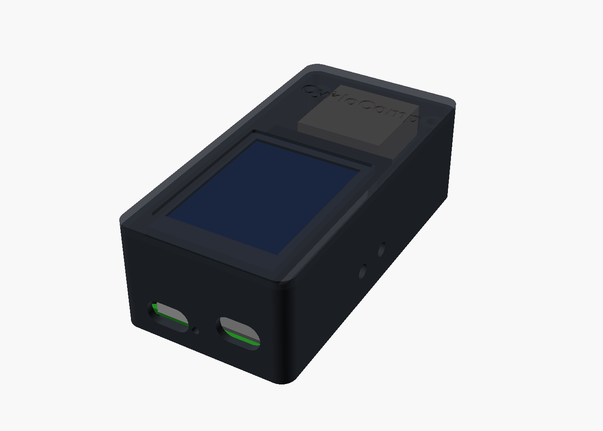
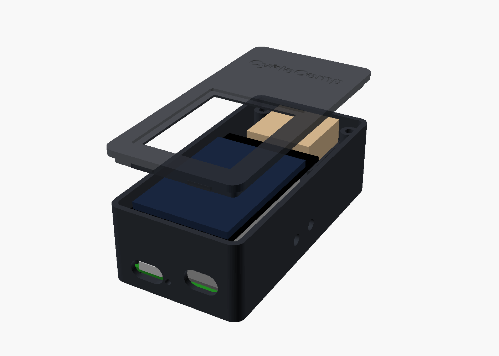
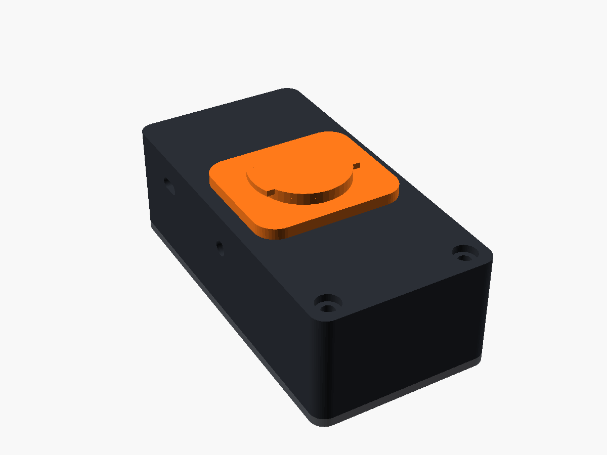

# CykloComp – 3D tištěná krabička (Garmin quarter-turn)

Parametrická krabička v **OpenSCADu** pro desku CykloPCB v1, Li-Po 103450,
displej 2,0" ST7789 a GPS s keramickou anténou 25×25 mm. Na spodku je
**Garmin quarter-turn „zobáček“**, takže pasuje do běžných držáků Garmin
(out-front držák na řídítka, držák na představec…).

| Sestava | Rozložená | Spodek |
|---|---|---|
|  |  |  |

Vnější rozměr cca **48 × 97 × 30 mm** (+ 3 mm zobáček). S tenčí baterií
803450 (8 mm) je krabička o 2 mm tenčí.

## Díly (`stl/`)

| Soubor | Co to je | Tisk |
|---|---|---|
| `garmin_test.stl` | **jen zobáček** – vytiskni první (10 min) a vyzkoušej na svém držáku | plochou dolů |
| `base.stl` | vanička: otvory pro 2× USB-C, světlovod LED, vypínač, 3 tlačítka; sloupky pro PCB, podstavec GPS | dnem dolů, bez podpěr |
| `lid.stl` | víčko: okno displeje, zahloubení pro ochranné okénko, kapsa pro sklo LCD, úchyty displeje | už otočené okénkem dolů |
| `tray.stl` | deska pod baterii se 4 sloupky (sešroubuje se s PCB) | plochou dolů |
| `cleat.stl` | Garmin zobáček s deskou, přišroubuje se 2× M3 na dno | deskou dolů |

Materiál **PETG nebo ASA** (PLA na slunci v létě změkne), 0,2 mm vrstva,
4 obvody, 30 % výplň.

## Než začneš tisknout – změř a uprav parametry

Otevři `cyklocomp_case.scad` v OpenSCADu (zdarma, <https://openscad.org>) a
v horní části uprav podle svých dílů (posuvným měřítkem):

- `disp_pcb`, `disp_glass`, `disp_glass_off`, `disp_active`, `disp_holes` – **displej**
  (každý výrobce 2,0" modulu ho má trochu jinak). Pro větší displej 2,4" / 2,8"
  přepiš rozměry – zbytek krabičky se přizpůsobí.
- `batt` – baterie (103450 = 34 × 50 × 10 mm).
- `esp_on_pins` – ESP32-C3-Zero na kolíkové liště (`true`) nebo naplocho (`false`, o 0,6 mm nižší).
- `cleat_angle` – když po zacvaknutí do držáku stojí krabička bokem, přepni 0 ↔ 90.
- `fit` – vůle mezi díly (0,25 mm; když víčko jde ztuha, dej 0,35).

V OpenSCADu pak **F6** (render) a **File → Export → STL**, nebo spusť `./build.sh`.

## Garmin zobáček

Rozměry vychází z open-source držáku
[chadkirby/quarter-turn-mount](https://github.com/chadkirby/quarter-turn-mount)
(krček Ø 24,9 mm, ouška Ø 28,6 × 11 mm, tloušťka 1,5 mm). Garmin rozměry
oficiálně nezveřejňuje a držáky se liší, proto:

1. Vytiskni `garmin_test.stl`.
2. Zkus ho zacvaknout do držáku. Jde ztuha → zmenši `cleat_lug_t` / `cleat_lug_d`
   o 0,1–0,2 mm; volné → zvětši. Šipka na spodku = směr jízdy.
3. Pak teprve tiskni `cleat.stl`. Zobáček se přišroubuje 2× **M3 × 4
   zápustnými šrouby** zevnitř krabičky + kapka lepidla (sekundové / epoxid).

## Sestavení

1. **Tray + PCB do vaničky**: PCB vlož do vaničky (USB-C k zadní stěně,
   tlačítka k bočním otvorům), na ni polož `tray` a vše stáhni 4× **M2.5 × 12**
   (samořezné „PT“ šrouby do plastu) do sloupků ve dně.
2. **Baterie** na tray – oboustrannou pěnovou páskou (drží a tlumí otřesy).
   Konektor JST do J4 (**zkontroluj polaritu!**).
3. **GPS** (anténa keramikou nahoru) na podstavec vpředu, kabel na J3.
4. **Displej** zespodu do víčka: sklo zapadne do kapsy, u konektoru 2× **M2 × 4**
   samořezné šrouby. Vodiče z J2 na displej co nejkratší (dupont konektory se
   nad baterii nevejdou – vodiče připájej).
5. **Ochranné okénko**: z 1 mm čirého polykarbonátu/plexi (lepší je PC – nepraskne)
   vyřízni obdélník do zahloubení ve víčku a přilep po obvodu (UV lepidlo / B-7000).
6. **Víčko**: zadní zobáčky zasuň šikmo do drážek v zadní stěně, přiklop a zespodu
   zašroubuj 2× **M3 × 25** do předních sloupků.
7. Těsnění: na horní hranu stěn nalep 1 mm pěnovou EPDM pásku; otvory USB-C kryj
   gumovými záslepkami (prodávají se jako „USB-C dust plug“), otvůrek LED zalij
   kapkou čirého lepidla.

## Co dokoupit ke krabičce

- šrouby: 4× M2.5×12 PT (do plastu), 2× M2×4 PT, 2× M3×25, 2× M3×4 zápustné
- 1 mm čirý polykarbonát (stačí kousek 40 × 50 mm)
- EPDM pěnová páska 3 × 1 mm, oboustranná pěnová páska, 2× silikonová záslepka USB-C
- Garmin držák (originál „Garmin quarter-turn out-front“ nebo levná kopie z AliExpressu)
