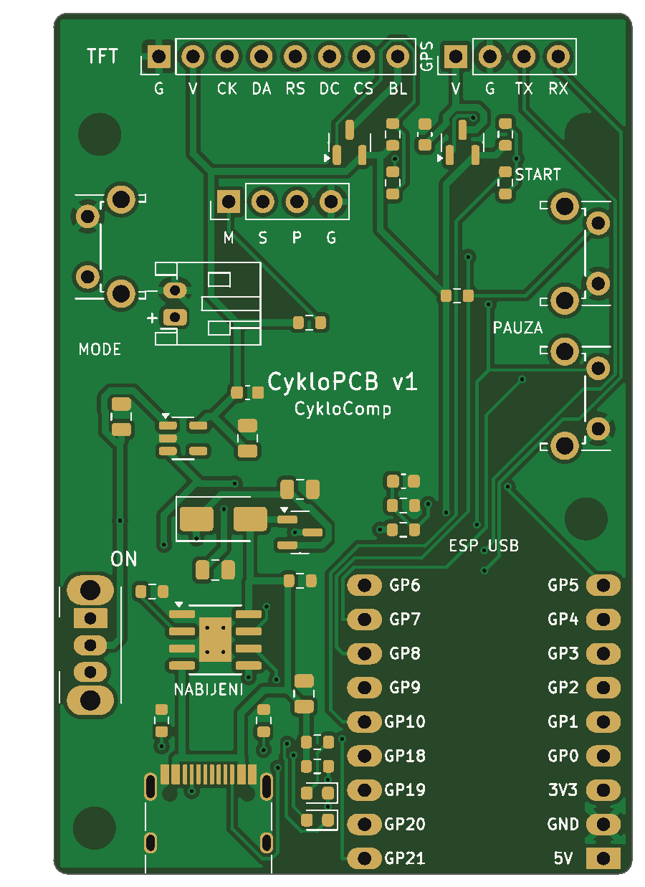
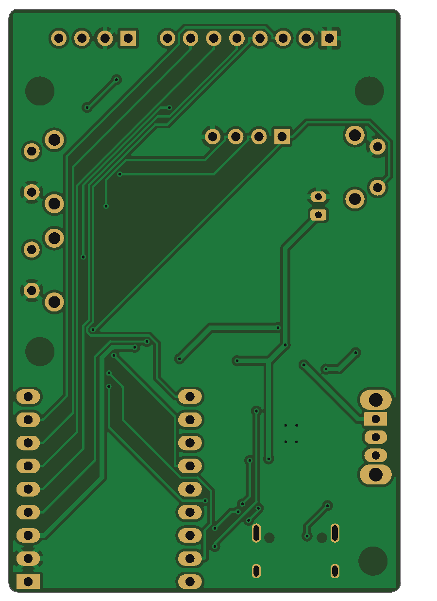

# CykloPCB v1 – plošný spoj pro CykloComp

Nosná deska 43 × 64 mm, na kterou se připájí **Waveshare ESP32-C3-Zero**,
připojí **displej**, **GPS** a **Li-Po baterie**. Řeší všechno, co na
nepájivém poli chybělo: nabíjení přes USB-C s „power-path“, vypínač,
3,3 V stabilizátor, měření baterie, vypínání GPS a podsvícení (pro spánek)
a tři boční tlačítka.

| Horní strana | Spodní strana |
|---|---|
|  |  |

Schéma: [`schema_zapojeni.svg`](schema_zapojeni.svg) ([PNG](schema_zapojeni.png))

## Co je na desce

| Blok | Součástky | Proč |
|---|---|---|
| Nabíjení | USB-C (J1) + **TP4056** (U1), 600 mA, LED červená = nabíjí, zelená = nabito | stejný čip jako tvůj modul, ale… |
| **Load-sharing (power-path)** | Schottky D3 + P-MOSFET Q1 | …když je zapojené USB, CykloComp jede z USB a baterie se jen nabíjí. Modul TP4056 tohle neumí → při nabíjení za jízdy (powerbanka) baterii trvale „dobíjí“ a nikdy neukončí nabíjení. |
| Vypínač | posuvný SW1 na boku | skutečně odpojí elektroniku (0 µA), nabíjení funguje i vypnuté |
| 3,3 V | **AP2112K-3.3** (U2), 600 mA, malý úbytek | baterie se využije až do ~3,4 V |
| Měření baterie | dělič 100k/100k → GPIO0 | % baterie na displeji i v appce, poznání USB nabíjení, vypnutí při vybití |
| Spínání GPS | P-MOSFET Q2 ← GPIO10 | GPS (~25 mA) se ve spánku úplně vypne |
| Podsvícení | P-MOSFET Q3 ← GPIO7 (PWM) | jas displeje + vypnutí ve spánku (displeje s pinem BLK) |
| Tlačítka | 3× úhlové tlačítko na hraně (MODE/START/PAUZA) + J5 pro externí vodotěsná | MODE umí probudit ESP z deep sleep (GPIO5) |

Zapojení ESP32-C3-Zero (pady číslované od USB):

| Pin modulu | Funkce | Pin modulu | Funkce |
|---|---|---|---|
| 5V | **nezapojeno** (USB modulu jen na programování) | GP21 | → RX GPS |
| GND | GND | GP20 | ← TX GPS |
| 3V3 | 3,3 V z desky | GP19, GP18 | – |
| GP0 | měření baterie | GP10 | zapnutí GPS |
| GP1–GP4 | TFT RST, DC, CS, SCLK | GP9 | tlačítko PAUZA (= BOOT) |
| GP5 | tlačítko MODE (probouzí) | GP8 | tlačítko START |
| | | GP7 / GP6 | podsvícení PWM / TFT MOSI |

> ⚠️ **Před objednáním zkontroluj** rozložení pinů svého modulu ESP32-C3-Zero
> proti potisku na desce (u každé plošky je napsané GPIO). Vychází z
> dokumentace Waveshare (pady 1–3 = 5V/GND/3V3, pady 4–14 = GP0–GP10). Řady pinů
> jsou na footprintu 17,78 mm od sebe a plošky jsou prodloužené, takže modul jde
> připájet přes kolíkovou lištu i naplocho za půlotvory na okraji.

## Jak objednat u JLCPCB (orientačně 30–60 € za 5 desek, z toho 2 osazené, vč. dopravy a DPH)

1. Na <https://jlcpcb.com> → **Order now** → **Add gerber file** →
   nahraj `build/CykloPCB_v1_gerber_JLCPCB.zip`.
2. Parametry nech výchozí: 2 vrstvy, 1,6 mm, HASL (lead free je hezčí),
   barva libovolná (zelená je nejlevnější a nejrychlejší), 5 ks.
3. Zapni **PCB Assembly** → *Economic*, **Top side**, počet osazených 2 nebo 5.
4. Nahraj **BOM** `build/CykloPCB_v1_BOM_JLCPCB.csv` a **CPL**
   `build/CykloPCB_v1_CPL_JLCPCB.csv`.
5. V náhledu osazení **zkontroluj otočení** součástek (hlavně TP4056 – tečka =
   pin 1, MOSFETy, LED a USB-C). Když něco sedí natočené, JLC ho otočí
   tlačítkem *Rotate* přímo v náhledu. Typicky bývá potřeba otočit USB-C a SOT-23.
6. Pokud některá součástka není skladem, JLC nabídne náhradu (rezistory /
   kondenzátory klidně, u TP4056/AP2112K vyber stejný čip jiného výrobce).

JLC osadí jen SMD součástky nahoře. **Ručně připájíš** (seznam
`build/CykloPCB_v1_rucni_osazeni.csv`):

| Pozice | Díl | Kde koupit |
|---|---|---|
| U3 | Waveshare ESP32-C3-Zero (máš) | – |
| SW1 | posuvný přepínač C&K OS102011MA1QN1 (úhlový, 2,54 mm) | TME, Mouser, AliExpress „OS102011MA1Q“ |
| SW2–SW4 | úhlové tlačítko 6×6 mm C&K PTS645VL31-2 LFS (nebo kompatibilní) | TME, Mouser |
| J4 | JST PH 2,0 mm 2pin horizontální (S2B-PH-K) | TME, AliExpress |
| J2, J3, J5 | kolíková lišta 2,54 mm (nebo rovnou připájet vodiče) | kdekoli |

## Postup oživení (důležité – v tomhle pořadí)

1. **Bez baterie a bez ESP**: připoj USB-C (NABÍJENÍ). Červená LED musí
   blikat/svítit (nabíječka bez baterie). Multimetrem: VSW ≈ 4,6 V (vypínač ON),
   3V3 = 3,3 V. Teprve pak dál.
2. **Zkontroluj polaritu baterie!** Čínské Li-Po s konektorem JST PH mívají
   prohozené kabely. Na desce je u J4 potisk **+** a **−**. Případně kabely
   v konektoru přehoď (jehlou nadzvedni západku).
3. Baterie **musí mít ochranný obvod (PCM)** – u 103450 bývá pod páskou na
   vývodech malá destička. Deska ochranu proti podvybití nemá (hlídá ji firmware
   + PCM v baterii).
4. Připájej ESP32-C3-Zero, tlačítka, vypínač, konektory.
5. Ve firmwaru nastav `#define BOARD_PROFILE BOARD_CYKLOPCB_V1`
   (v `firmware/CykloComp/CykloComp.ino`) a nahraj přes USB-C **na modulu ESP**.

## Jak deska vznikla / úpravy

Deska se generuje skriptem – nic se nekreslí ručně:

```bash
cd hardware/pcb
python3 generate_pcb.py --freerouting /cesta/k/freerouting-1.9.0.jar
python3 render_preview.py      # náhledy PNG
python3 schematic.py           # schéma
```

- `generate_pcb.py` – seznam součástek, spojů a pozic → KiCad deska →
  autorouter **Freerouting** → rozlití země → **DRC** → Gerber/vrtání/BOM/CPL/STEP.
- `CykloPCB_v1.kicad_pcb` – otevřeš v **KiCadu 7+** a můžeš cokoliv upravit ručně
  (pak exportuj Gerbery z KiCadu: *File → Fabrication Outputs*).
- `build/drc.rpt` – kontrola návrhových pravidel: 0 porušení, 0 nepřipojených
  plošek (řádky `lib_footprint_issues` = jen chybějící tabulka knihoven, nevadí). Když deska není čistá, skript výrobní data **nevytvoří** (`--force` to obejde).
- `build/CykloPCB_v1.step` – 3D model desky (pro kontrolu v krabičce).

Pravidla jsou nastavená bezpečně pro JLCPCB: cesty ≥ 0,25 mm (napájení 0,5 mm),
mezery ≥ 0,2 mm, prokovy 0,7/0,3 mm (mezikruží 0,2 mm), měď ≥ 0,45 mm od rovných
hran (v zaoblených rozích a u pinu 1 modulu ESP ≥ 0,3 mm).

### JLCPCB DFM kontrola (po úpravách v2)

| Kontrola | Co se změnilo |
|---|---|
| Slot width (4 chyby) | sloty stínění USB-C 0,6 → **0,7 mm** (plošky 1,1 mm) |
| Annular ring (62 varování) | prokovy 0,6/0,3 → **0,7/0,3 mm** |
| tht to smd (1 chyba + 6 varování) | zemnicí prokovy už nejsou **v** plošce TP4056 (EP), ale 0,3 mm vedle, napojené cestou 0,5 mm; autorouter drží prokovy ≥ 0,3 mm od SMD plošek; LED + rezistory posunuté dál od pinů modulu ESP32-C3-Zero |
| Silkscreen to hole (4 chyby) | potisk se po routování ořízne ≥ 0,25 mm od každého otvoru a ≥ 0,2 mm od hrany desky, značky pinu 1 a texty se odsunou |
| Silkscreen line width (50) | všechen potisk ≥ **0,16 mm** |
| Negative soldermask expansion (38) | maska +0,05 mm kolem plošek (USB-C +0,025 mm) |
| Soldermask multiple segments (4) | zdvojené plošky USB-C (A1/B12…) už nemají dvojitý otvor v masce |
| Pad spacing (1 varování) | **bez změny** – rozteč 0,5 mm konektoru USB-C (mezera 0,2 mm), JLC vyrábí od 0,15 mm, s osazením JLC to je běžné |
