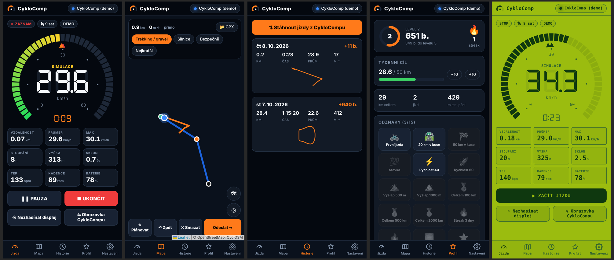

# CykloComp – webová aplikace (PWA)

Mobilní aplikace pro CykloComp, která běží **v prohlížeči** a připojuje se
k cyklopočítači přes **Web Bluetooth**. Nic se nekompiluje, nepotřebuješ
Android Studio, JDK ani Google Maps API klíč. Na telefonu ji „nainstaluješ“
přes *Přidat na plochu* a pak se chová jako normální appka (ikona, celá
obrazovka, funguje i offline).



## Co umí

| Záložka | Funkce |
|---|---|
| **Jízda** | budík rychlosti jako na displeji, 9 dlaždic (vzdálenost, průměr, max, stoupání, výška, sklon, tep, kadence, baterie), start / pauza / stop, „nezhasínat displej“, přepínání obrazovek CykloCompu |
| **Mapa** | živá poloha a projetá stopa, plánování trasy klepáním (BRouter – trekking/gravel, silnice, bezpečně, nejkratší), výškový profil, přetahování bodů, **import GPX** (z Mapy.cz, Komootu, Stravy…), odeslání trasy + okolních ulic do CykloCompu |
| **Historie** | jízdy se po připojení **samy stáhnou z CykloCompu** (firmware v2 si je ukládá do flash), detail s mapou, **export GPX** (nahraješ na Stravu) |
| **Profil** | body, levely, streak, týdenní cíl, 15 odznaků |
| **Nastavení** | téma displeje (Noc / Retro / Den), jas, autopauza, BLE senzory, automatické vypnutí, rozsah budíku, dlaždice 2×2, odometr, simulace GPS, vypnutí; záloha/obnova dat |

Bez hardwaru jde všechno vyzkoušet tlačítkem **Vyzkoušet demo** (nebo
otevři adresu s `?demo`).

## Kde to poběží

| Telefon / prohlížeč | Bluetooth |
|---|---|
| Android + **Chrome** / Edge / Samsung Internet | ✅ funguje |
| iPhone + Safari / Chrome | ❌ Apple Web Bluetooth nepodporuje → použij prohlížeč **Bluefy** (App Store, zdarma) |
| PC / Mac + Chrome / Edge | ✅ funguje (hodí se na testování) |
| Firefox | ❌ |

Web Bluetooth vyžaduje **HTTPS** (nebo `localhost`).

## Jak ji dostat na telefon

### A) GitHub Pages (doporučeno, zdarma)
1. V repozitáři: **Settings → Pages → Build and deployment → Source: GitHub Actions**.
2. Po pushi do `main` workflow `.github/workflows/pages.yml` nasadí složku
   `webapp/` na `https://<uživatel>.github.io/<repo>/`.
3. Na telefonu otevři adresu v Chrome → menu ⋮ → **Přidat na plochu / Instalovat aplikaci**.

> U **soukromého** repozitáře jsou GitHub Pages jen v placeném účtu. Pak
> použij variantu B.

### B) Netlify / Cloudflare Pages (zdarma, bez gitu)
Na <https://app.netlify.com/drop> přetáhni celou složku `webapp/` – dostaneš
HTTPS adresu, kterou otevřeš v telefonu.

### C) Lokálně na PC (vývoj)
```bash
cd webapp
python3 -m http.server 8000
# otevři http://localhost:8000  (Chrome na PC umí Bluetooth i na localhostu)
```

## Jak to funguje uvnitř

- Bez build kroku – čistý JavaScript (ES moduly), knihovny jsou přibalené
  ve `vendor/` (Leaflet, 7-segmentový font DSEG7), takže appka funguje offline.
- `js/ble.js` – Web Bluetooth: fronta GATT operací, automatické znovupřipojení,
  když přijde useknutá notifikace (malé MTU), dočte celou hodnotu `readValue()`.
- `js/demo.js` – simulovaný CykloComp se stejným protokolem.
- `js/device.js` – stav, synchronizace jízd (`SYNC:LIST/SUM/TRK/DEL`), body.
- Data zůstávají **jen v telefonu** (IndexedDB + localStorage); zálohu uděláš
  v Nastavení → Záloha dat.
- Mapy: OpenStreetMap / CyclOSM / OpenTopoMap, trasy BRouter (fallback OSRM),
  ulice Overpass API – veřejné služby, appka je nezatěžuje zbytečně.

## Omezení (poctivě)

- Když je telefon zamčený / appka na pozadí, prohlížeč ji uspí. **Nevadí to** –
  jízdu zaznamenává CykloComp sám a appka si ji stáhne, až ji znovu otevřeš.
- Na iPhonu jen přes Bluefy (viz výše).
